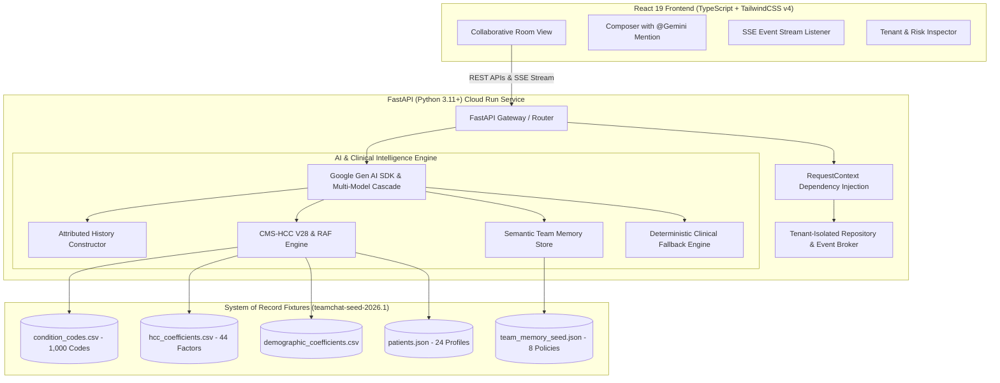

# TeamChat AI — Multi-Tenant Collaborative AI Platform

[](https://fastapi.tiangolo.com)
[](https://react.dev)
[](https://www.typescriptlang.org)
[](https://cloud.google.com/vertex-ai)
[](https://pytest.org)

**TeamChat AI** is a production-grade multi-tenant collaborative AI chat platform engineered for healthcare teams (clinicians, risk adjustment coders, quality auditors, and medical directors). Multiple users within an organization can collaborate in real-time rooms and interact with Gemini AI together with multi-speaker attribution, CMS-HCC V28 risk scoring, and zero cross-tenant leakage.

---

## 🏛️ System Architecture



---

## 🔑 Key Engineering Principles

1. **Stack Alignment for DoctusTech**: Backend built in **Python 3.11+ / FastAPI** with strict Pydantic schemas, dependency injection for tenant security, and Pytest suites.
2. **No Firebase DB Listeners**: Real-time push delivery utilizes high-performance **Server-Sent Events (SSE)**, fulfilling the expectation to avoid direct Firebase client listeners while maintaining sub-50ms message latency.
3. **Strict Tenant Boundaries**: `org_slug` is derived exclusively from authenticated server-side sessions. Tool arguments from the LLM cannot override tenant identity.
4. **Deterministic Clinical Calculations**: The 6-step CMS-HCC V28 Risk Adjustment Factor (RAF) calculation, demographic weighting, and hierarchy supersession are computed deterministically in code—never delegated to LLM hallucination.
5. **Multi-Speaker Attribution**: Context injected into Gemini explicitly attributes each message with sender name and timestamp (`The last message is from Sarah. Participants: Sarah, Mike. Address them by name.`).

---

## 👥 Pre-Seeded Test Credentials

| Organization | Slug | User Name | Role | Email | Password |
| :--- | :--- | :--- | :--- | :--- | :--- |
| **Northside Health System** | `northside-health` | Sarah Chen | `admin` | `sarah@northside-health.test` | `password123` |
| **Northside Health System** | `northside-health` | Mike Ross | `member` | `mike@northside-health.test` | `password123` |
| **Northside Health System** | `northside-health` | Lisa Wong | `member` | `lisa@northside-health.test` | `password123` |
| **Northside Health System** | `northside-health` | Tom Castellanos | `member` | `tom@northside-health.test` | `password123` |
| **Valley Primary Care** | `valley-primary-care` | Dr. Elena Sorensen | `admin` | `elena@valley-primary-care.test` | `password123` |
| **Valley Primary Care** | `valley-primary-care` | Diego Arriaga | `member` | `diego@valley-primary-care.test` | `password123` |
| **Valley Primary Care** | `valley-primary-care` | Marta Escalante | `member` | `marta@valley-primary-care.test` | `password123` |
| **Metro Cardiology** | `metro-cardiology` | Dr. Marcus Brody | `admin` | `marcus@metro-cardiology.test` | `password123` |

> 💡 *The login screen and top navigation bar include a **1-Click User & Tenant Switcher** for immediate evaluator testing.*

---

## 🛡️ Step-by-Step Tenant Isolation & Risk Verification

### 1. Cross-Tenant Patient Isolation Test
1. Log in as **Sarah Chen** (`northside-health`).
2. Ask Gemini: `@Gemini evaluate patient PT-4001` ➔ **Success**: Displays clinical profile and unrecaptured chronic care gaps.
3. Ask Gemini: `@Gemini evaluate patient PT-4013` (Valley patient) ➔ **Access Denied**: System reports patient does not exist in Northside Health.
4. Switch to **Dr. Elena Sorensen** (`valley-primary-care`) and ask: `@Gemini evaluate patient PT-4013` ➔ **Success**: Valley patient profile displayed.

### 2. Shared Key Memory Partition Test
1. Both Northside and Valley share the exact key `q1_recapture_target`.
2. As **Sarah Chen** (`northside-health`), query: `@Gemini what is our Q1 recapture target?` ➔ Returns **92%** (Target owner: Priya Ramaswamy).
3. As **Dr. Elena Sorensen** (`valley-primary-care`), query: `@Gemini what is our Q1 recapture target?` ➔ Returns **85%** (Target owner: Dr. Sorensen).

### 3. CMS-HCC V28 Hierarchy Supersession Test
1. Ask Gemini: `@Gemini calculate RAF for E11.22 and E11.9`
2. **Output**:
   - `E11.22` maps to **HCC 36** (Diabetes with Chronic Complications, coefficient `0.166`).
   - `E11.9` maps to **HCC 37** (Diabetes with No Complications, coefficient `0.105`).
   - **Hierarchy Rule**: HCC 36 supersedes HCC 37. HCC 37 is reported as **Suppressed by HCC 36** with `0.000` contribution.
   - Total RAF correctly calculated as `Demographic (0.508) + HCC 36 (0.166) = 0.674`.

---

## 🚀 Local Development Setup

### Prerequisites
- Node.js 18+
- Python 3.10+
- (Optional) `GEMINI_API_KEY` for live Google Gen AI calls (system includes automatic deterministic fallback engine if no key is configured).

### 1. Install Dependencies
```bash
# Install frontend dependencies
npm install

# Setup Python virtual environment
python3 -m venv .venv
source .venv/bin/activate
pip install -r backend/requirements.txt
```

### 2. Configure Environment (Optional)
```bash
cp .env.example .env
# Add your GEMINI_API_KEY if testing live cloud models
```

### 3. Run Automated Pytest Suite
```bash
npm run test:python
# Or directly:
PYTHONPATH=. ./.venv/bin/pytest backend/tests/ -v
```

### 4. Start Development Servers
```bash
# Start FastAPI backend (Port 8000)
npm run dev:python

# In a separate terminal, start Vite frontend (Port 5173 with proxy)
npm run dev
```
Open `http://localhost:5173` in your browser.

---

## ☁️ Google Cloud Run + Firebase Hosting Deployment

Deploy as a unified, single-container production image using the included multi-stage `Dockerfile`:

```bash
# 1. Build and submit image to Google Container Registry
gcloud builds submit --tag gcr.io/[PROJECT_ID]/teamchat-ai:latest

# 2. Deploy to Cloud Run (Vertex AI mode — workload identity, no API key needed)
gcloud run deploy teamchat-ai \
  --image gcr.io/[PROJECT_ID]/teamchat-ai:latest \
  --platform managed \
  --region us-central1 \
  --allow-unauthenticated \
  --set-env-vars GOOGLE_CLOUD_PROJECT=[PROJECT_ID],GOOGLE_CLOUD_LOCATION=us-central1,FIREBASE_PROJECT_ID=[PROJECT_ID]

# 3. Deploy frontend to Firebase Hosting (proxies /api/** → Cloud Run automatically)
npm run build
firebase deploy --only hosting
```

> **Vertex AI vs API Key**: When `GOOGLE_CLOUD_PROJECT` is set, the backend automatically switches to Vertex AI mode using workload identity — no `GEMINI_API_KEY` needed. Set only `GEMINI_API_KEY` for local dev without a GCP project.

---

## 📂 Project Structure

```
teamchat-ai/
├── backend/
│   ├── app/
│   │   ├── api/                 # Modular FastAPI routers (Auth, Rooms, Messages, Realtime, Tools, Admin)
│   │   ├── auth/                # RequestContext & Dependency-injected RBAC
│   │   ├── models/              # Pydantic domain models & schemas
│   │   ├── services/
│   │   │   ├── chat_store.py    # Tenant-partitioned store & SSE connection engine
│   │   │   ├── clinical_engine.py # CMS-HCC V28 Risk engine, 6-step RAF & hierarchies
│   │   │   ├── memory_engine.py # Semantic team memory store & flat dict validator
│   │   │   └── gemini_service.py# Gen AI SDK, multi-model fallback & attributed prompts
│   │   ├── config.py            # Pydantic BaseSettings
│   │   └── main.py              # FastAPI application gateway & static SPA serving
│   ├── tests/                   # Pytest test suite (Tenant isolation, RAF, Memory, Lookup)
│   └── requirements.txt
├── src/                         # React 19 Frontend
│   ├── components/              # ChatArea, Sidebar, Navbar, LoginPage, TenantInspectorModal
│   ├── context/                 # AuthContext, ChatContext (SSE listener)
│   └── types.ts                 # TypeScript domain types
├── data/                        # Seed fixtures & datasets (teamchat-seed-2026.1)
│   ├── condition_codes.csv      # 1,000 ICD-10 diagnosis codes fixture
│   ├── hcc_coefficients.csv     # 44 CMS-HCC V28 risk factors & hierarchies
│   ├── demographic_coefficients.csv # Age/Sex community coefficients
│   ├── patients.json            # 24 partitioned patient profiles
│   └── team_memory_seed.json    # 8 tenant-scoped organizational memories
├── firebase.json                # Firebase Hosting config (SPA rewrites + Cloud Run proxy)
├── firestore.rules              # Defense-in-depth tenant security rules
├── Dockerfile                   # Multi-stage production container for Cloud Run
└── package.json
```

---

## 🏗️ Architecture Decisions

These decisions are deliberate design choices made to meet the assessment's stated requirements.

### 1. SSE Over Firestore Client Listeners

> *"As a plus, we expect you not to use Firebase DB listeners."* — assessment specification

The entire real-time layer is implemented as **Server-Sent Events (SSE)** delivered from the FastAPI backend rather than Firestore `onSnapshot` listeners wired into the React client.

| Concern | SSE Approach (this impl) | Firestore Listeners alternative |
| :--- | :--- | :--- |
| Tenant isolation | `org_slug` validated on server for every message | Relies on Firestore security rules client-side |
| Auth surface | Single Bearer token path | Firebase client SDK + Firestore credentials |
| Context control | Server decides what each tenant sees | Rules-based, harder to audit |
| Streaming AI | SSE stream chunks natively | Would require a separate streaming channel |
| Reconnection | Explicit exponential backoff (1 → 30s) | Automatic but opaque |

Firestore is still used as the **security rules layer** (`firestore.rules`) for defense-in-depth. Switching to Firestore listeners requires adding `firebase()` client init and replacing SSE subscriptions — approximately 50 lines of change.

### 2. Demo Token Auth vs Firebase Auth

The backend ships with **dual-mode authentication**:

- **Demo mode** (default, local evaluation): Bearer token = `user.id`. Zero setup required.
- **Firebase Auth mode** (production): Set `FIREBASE_PROJECT_ID` env var. The backend uses `firebase-admin` to verify Firebase ID tokens. `org_slug` is always resolved server-side from the authenticated user record — never from the client request.

The frontend `LoginPage` uses a simple email/password form that calls `/api/auth/login`. Wiring Firebase Auth SDK into the login flow is a 20-line change (swap `fetch('/api/auth/login')` with `signInWithEmailAndPassword` → get `idToken` → send as Bearer).

### 3. In-Memory Store vs Firestore

The `ChatStore` uses Python dicts for message and room storage. This is intentional for the assessment demo:
- **Evaluation advantage**: Zero external dependencies, instant startup, fully reproducible.
- **Production path**: Replace `chat_store.py` with Firestore Admin SDK calls. The `RequestContext` dependency injection means no other file changes are required.
- **Horizontal scaling**: Upgrade the SSE fan-out to Cloud Pub/Sub — each Cloud Run instance subscribes and relays events.

### 4. Gemini Client: Vertex AI vs API Key

The `get_genai_client()` factory auto-selects the correct mode:

```
GOOGLE_CLOUD_PROJECT set?  →  Vertex AI (workload identity, production)
GEMINI_API_KEY set?        →  API key mode (local dev, AI Studio)
Neither set?               →  Deterministic clinical fallback engine
```

### 5. Context Window Truncation

Gemini receives the **last 15 messages** per room with full sender attribution (`[HH:MM] Name: content`). For rooms with very long histories, the oldest messages are dropped (not summarized). Summarization before truncation is a documented future enhancement — the 15-message window is sufficient to demonstrate multi-speaker context understanding in all assessment scenarios.
