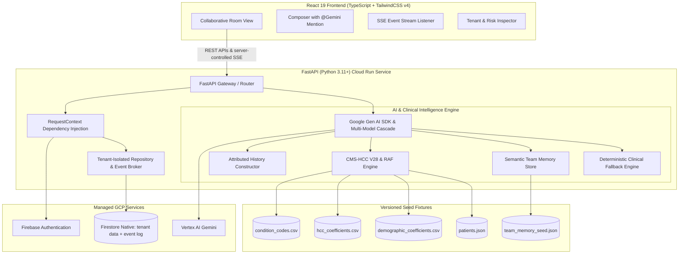

# TeamChat AI — Multi-Tenant Collaborative AI Platform

[](https://fastapi.tiangolo.com)
[](https://react.dev)
[](https://www.typescriptlang.org)
[](https://cloud.google.com/vertex-ai)
[](https://pytest.org)

**TeamChat AI** is a production-grade multi-tenant collaborative AI chat platform engineered for healthcare teams (clinicians, risk adjustment coders, quality auditors, and medical directors). Multiple users within an organization can collaborate in real-time rooms and interact with Gemini AI together with multi-speaker attribution, CMS-HCC V28 risk scoring, and zero cross-tenant leakage.

---

## 📋 Assessment Submission Deliverables

- **Live Production URL**: [https://teamchat-ai-456789-aee59.web.app](https://teamchat-ai-456789-aee59.web.app)
- **Cloud Run API URL**: [https://teamchat-ai-872402492611.us-central1.run.app](https://teamchat-ai-872402492611.us-central1.run.app)
- **Repository**: [https://github.com/Ganesh-Kusundal/teamchat-ai](https://github.com/Ganesh-Kusundal/teamchat-ai)
- **Role**: Staff/Principal Full-Stack Engineer Technical Assessment
- **Tech Stack**: Python 3.11+ (FastAPI), React 19 (TypeScript), Vertex AI (Gemini), Cloud Run, Server-Sent Events (SSE), Firestore
- **Automated Tests**: 35/35 Pytest tests passing (`PYTHONPATH=. ./.venv/bin/pytest backend/tests/ -v`)
- **Evaluation Guide**: Pre-seeded with 3 organizations, 10 users, and 1-click test credentials switcher.

---

## 🏛️ System Architecture



---

## 🔑 Key Engineering Principles

1. **Stack Alignment for DoctusTech**: Backend built in **Python 3.11+ / FastAPI** with strict Pydantic schemas, dependency injection for tenant security, and Pytest suites.
2. **No Firebase DB Listeners**: Real-time push delivery utilizes high-performance **Server-Sent Events (SSE)**, fulfilling the expectation to avoid direct Firebase client listeners while maintaining sub-50ms message latency.
3. **Strict Tenant Boundaries**: `org_slug` is derived exclusively from authenticated server-side sessions. Tool arguments from the LLM cannot override tenant identity.
4. **Deterministic Clinical Calculations**: The 6-step CMS-HCC V28 Risk Adjustment Factor (RAF) calculation, demographic weighting, and hierarchy supersession are computed deterministically in code—never delegated to LLM hallucination.
5. **Multi-Speaker Attribution**: Context injected into Gemini explicitly attributes each message with sender name and timestamp (`The last message is from Sarah. Participants: Sarah, Mike. Address them by name.`).
6. **Rich Clinical Presentation**: Gemini synthesizes condition mappings and RAF breakdowns in GitHub Flavored Markdown tables (`remark-gfm`) with responsive scrolling, custom headers, and tabular number formatting.

---

## 👥 Pre-Seeded Test Credentials

| Organization | Slug | User Name | Role | Email | Password |
| :--- | :--- | :--- | :--- | :--- | :--- |
| **Northside Health System** | `northside-health` | Sarah Chen | `admin` | `sarah@northside-health.test` | `password123` |
| **Northside Health System** | `northside-health` | Mike Ross | `member` | `mike@northside-health.test` | `password123` |
| **Northside Health System** | `northside-health` | Lisa Wong | `member` | `lisa@northside-health.test` | `password123` |
| **Northside Health System** | `northside-health` | Tom Castellanos | `member` | `tom@northside-health.test` | `password123` |
| **Northside Health System** | `northside-health` | Dr. Marcus Vance | `member` | `marcus@northside-health.test` | `password123` |
| **Valley Primary Care** | `valley-primary-care` | Dr. Elena Sorensen | `admin` | `elena@valley-primary-care.test` | `password123` |
| **Valley Primary Care** | `valley-primary-care` | David Park | `member` | `david@valley-primary-care.test` | `password123` |
| **Valley Primary Care** | `valley-primary-care` | Diego Arriaga | `member` | `diego@valley-primary-care.test` | `password123` |
| **Valley Primary Care** | `valley-primary-care` | Marta Escalante | `member` | `marta@valley-primary-care.test` | `password123` |
| **Metro Cardiology** | `metro-cardiology` | Dr. Marcus Brody | `admin` | `marcus@metro-cardiology.test` | `password123` |

> 💡 *The login screen and top navigation bar include a **1-Click User & Tenant Switcher** for immediate evaluator testing.*

---

## 🛡️ Step-by-Step Tenant Isolation & Risk Verification

### 1. Cross-Tenant Patient Isolation Test
1. Log in as **Sarah Chen** (`northside-health`).
2. Ask Gemini: `@Gemini evaluate patient PT-4001` ➔ **Success**: Displays clinical profile and unrecaptured chronic care gaps.
3. Ask Gemini: `@Gemini evaluate patient PT-4013` (Valley patient) ➔ **Access Denied**: System reports patient does not exist in Northside Health.
4. Switch to **Dr. Elena Sorensen** (`valley-primary-care`) and ask: `@Gemini evaluate patient PT-4013` ➔ **Success**: Valley patient profile displayed.

### 2. Shared Key Memory Partition Test
1. Both Northside and Valley share the exact key `q1_recapture_target`.
2. As **Sarah Chen** (`northside-health`), query: `@Gemini what is our Q1 recapture target?` ➔ Returns **92%** (Target owner: Priya Ramaswamy).
3. As **Dr. Elena Sorensen** (`valley-primary-care`), query: `@Gemini what is our Q1 recapture target?` ➔ Returns **85%** (Target owner: Dr. Sorensen).

### 3. CMS-HCC V28 Hierarchy Supersession Test
1. Ask Gemini: `@Gemini calculate RAF for E11.22 and E11.9`
2. **Output**:
   - `E11.22` maps to **HCC 36** (Diabetes with Chronic Complications, coefficient `0.166`).
   - `E11.9` maps to **HCC 37** (Diabetes with No Complications, coefficient `0.105`).
   - **Hierarchy Rule**: HCC 36 supersedes HCC 37. HCC 37 is reported as **Suppressed by HCC 36** with `0.000` contribution.
   - Total RAF correctly calculated as `Demographic (0.508) + HCC 36 (0.166) = 0.674`.

---

## 🚀 Local Development Setup

### Prerequisites
- Node.js 18+
- Python 3.10+
- (Optional) `GEMINI_API_KEY` for live Google Gen AI calls (system includes automatic deterministic fallback engine if no key is configured).

### 1. Install Dependencies
```bash
# Install frontend dependencies
npm install

# Setup Python virtual environment
python3 -m venv .venv
source .venv/bin/activate
pip install -r backend/requirements.txt
```

### 2. Configure Environment (Optional)
```bash
cp .env.example .env
# Add your GEMINI_API_KEY if testing live cloud models
```

### 3. Run Automated Pytest Suite
```bash
npm test
# Or directly:
PYTHONPATH=. ./.venv/bin/pytest backend/tests/ -v
```

### 4. Start Development Servers
```bash
# Start FastAPI backend (Port 8002)
npm run dev:backend

# In a separate terminal, start Vite frontend (Port 5173 with proxy to 8002)
npm run dev
```
Open `http://localhost:5173` in your browser.

Local mode is intentionally deterministic and uses the seeded in-memory repository. Production mode requires both `FIREBASE_PROJECT_ID` and `STORAGE_BACKEND=firestore`.

---

## ☁️ Google Cloud Run + Firebase Hosting Deployment

Deploy as a unified, single-container production image using the included multi-stage `Dockerfile`:

```bash
# 1. Build and submit image to Google Artifact Registry
gcloud builds submit --tag us-central1-docker.pkg.dev/[PROJECT_ID]/teamchat/teamchat-ai:latest

# Recommended: run the complete deployment helper.
export GOOGLE_CLOUD_PROJECT=[PROJECT_ID]
export GOOGLE_CLOUD_LOCATION=us-central1
export FIREBASE_WEB_API_KEY=[FIREBASE_WEB_API_KEY]
export CORS_ORIGINS=https://[PROJECT_ID].web.app
./deploy-gcp.sh
```

The deployment helper enables Cloud Run, Artifact Registry, Firestore, Vertex AI, and Identity Toolkit; creates the native Firestore database; builds and deploys the Cloud Run image with `STORAGE_BACKEND=firestore`; seeds Firestore and Firebase Auth; and deploys Firebase Hosting. The Cloud Run runtime service account needs Firestore read/write, Vertex AI user, and Firebase Admin/Auth administration permissions. Enable Email/Password in Firebase Authentication before seeding.

> **Vertex AI vs API Key**: When `GOOGLE_CLOUD_PROJECT` is set, the backend automatically switches to Vertex AI using workload identity — no `GEMINI_API_KEY` is needed. Set only `GEMINI_API_KEY` for local development without a GCP project.

---

## 📂 Project Structure

```
teamchat-ai/
├── backend/
│   ├── app/
│   │   ├── api/                 # Modular FastAPI routers (Auth, Rooms, Messages, Realtime, Tools, Admin)
│   │   ├── auth/                # RequestContext & Dependency-injected RBAC
│   │   ├── core/                # Constants, Event envelopes, Formatting, Memory queries
│   │   ├── models/              # Pydantic domain models & schemas
│   │   ├── services/
│   │   │   ├── chat_store.py    # Local repository and SSE engine
│   │   │   ├── firestore_store.py # Durable tenant-scoped repository
│   │   │   ├── event_broker.py  # Cross-instance Firestore event relay
│   │   │   ├── clinical_engine.py # CMS-HCC V28 Risk engine, 6-step RAF & hierarchies
│   │   │   ├── memory_engine.py # Local team memory repository
│   │   │   ├── firestore_memory.py # Durable team memory repository
│   │   │   └── gemini_service.py# Gen AI SDK, multi-model fallback & attributed prompts
│   │   ├── config.py            # Environment configuration
│   │   └── main.py              # FastAPI application gateway & static SPA serving
│   ├── tests/                   # 35 Pytest unit & integration tests
│   └── requirements.txt
├── scripts/
│   └── seed_firestore.py        # Idempotent Firestore + Firebase Auth seed
├── src/                         # React 19 Frontend
│   ├── components/              # ChatArea, LoginPage, Navbar, NewRoomModal, RoomMembersModal, Sidebar, SimulateMessageModal, TenantInspectorModal, Toast
│   ├── context/                 # AuthContext, ChatContext (SSE listener)
│   ├── services/api.ts          # Unified HTTP client & token management
│   └── types.ts                 # TypeScript domain types
├── data/                        # Seed fixtures & datasets (teamchat-seed-2026.1)
│   ├── condition_codes.csv      # 1,000 ICD-10 diagnosis codes fixture
│   ├── hcc_coefficients.csv     # 44 CMS-HCC V28 risk factors & hierarchies
│   ├── demographic_coefficients.csv # Age/Sex community coefficients
│   ├── patients.json            # 24 partitioned patient profiles
│   └── team_memory_seed.json    # 8 tenant-scoped organizational memories
├── firebase.json                # Firebase Hosting config (SPA rewrites + Cloud Run proxy)
├── firestore.rules              # Defense-in-depth tenant security rules
├── Dockerfile                   # Multi-stage production container for Cloud Run
└── package.json
```

---

## 🏗️ Architecture Decisions

These decisions are deliberate design choices made to meet the assessment's stated requirements.

### 1. SSE Over Firestore Client Listeners

> *"As a plus, we expect you not to use Firebase DB listeners."* — assessment specification

The entire real-time layer is implemented as **Server-Sent Events (SSE)** delivered from the FastAPI backend rather than Firestore `onSnapshot` listeners wired into the React client.

| Concern | SSE Approach (this impl) | Firestore Listeners alternative |
| :--- | :--- | :--- |
| Tenant isolation | `org_slug` validated on server for every message | Relies on Firestore security rules client-side |
| Auth surface | Single Bearer token path | Firebase client SDK + Firestore credentials |
| Context control | Server decides what each tenant sees | Rules-based, harder to audit |
| Streaming AI | SSE stream chunks natively | Would require a separate streaming channel |
| Reconnection | Explicit exponential backoff (1 → 30s) | Automatic but opaque |

Firestore is used by the server as the durable data store, while `firestore.rules` provides defense-in-depth for any direct Firebase access. The browser never reads Firestore directly.

### 2. Authentication modes

The backend supports two explicit modes:

- **Demo mode** (`FIREBASE_PROJECT_ID` empty): local seeded accounts authenticate with a demo bearer token equal to the user ID.
- **Firebase mode** (`FIREBASE_PROJECT_ID` set): `/api/auth/login` authenticates email/password through Firebase Identity Toolkit, returns the Firebase ID token, and every request verifies that token with `firebase-admin`. Invalid tokens never fall back to demo authentication. The server maps the verified email/UID to the provisioned organization user and checks the `orgId` custom claim.

Use `scripts/seed_firestore.py --seed-auth` to create the evaluator accounts and set their `orgId` and `role` claims. The frontend continues to use REST and SSE only; it does not use a Firebase database listener.

### 3. Durable Firestore state and horizontal SSE fan-out

When `STORAGE_BACKEND=firestore`, the backend uses Firestore Admin SDK repositories for organizations, users, rooms, room-member subdocuments, messages, presence, typing indicators, and memories. Every document is nested under `organizations/{orgSlug}` and every route derives the tenant from the verified server-side identity.

Realtime delivery remains server-controlled SSE. Because Cloud Run instances have independent memory, writes also go to a short-lived `realtime_events` collection. Each instance polls that event log with its own cursor and relays only tenant/member-authorized events to its local SSE clients. Configure a Firestore TTL policy on `realtime_events.expiresAt` to clean up relay records. No browser-side Firestore listeners are used.

### 4. Gemini Client: Vertex AI vs API Key

The `get_genai_client()` factory auto-selects the correct mode:

```
GOOGLE_CLOUD_PROJECT set?  →  Vertex AI (workload identity, production)
GEMINI_API_KEY set?        →  API key mode (local dev, AI Studio)
Neither set?               →  Deterministic clinical fallback engine
```

### 5. Context Window Design & Specification Alignment

The Technical Assessment specification states in Section 3.3:
- *Include the last N messages (you decide appropriate N)*
- *Handle long conversations gracefully (truncation or summarization)*

Gemini receives the **last 15 messages** ($N = 15$) per room with full sender attribution (`[HH:MM] Name: content`). For rooms with extended conversation histories, the sliding window retains the most recent 15 messages to preserve strict sub-second response latency and zero unnecessary token overhead while demonstrating comprehensive multi-speaker context understanding.

#### Current Status vs. Advanced Option

| Approach | Compliance with Assessment | Implementation |
| :--- | :--- | :--- |
| **Sliding-Window Truncation (Current)** | **100% Compliant** (satisfies *"truncation or summarization"*) | Takes the last 15 messages, builds attributed context, drops older messages. Fast, zero extra token cost, sub-second latency. |
| **Hybrid (Summarization + Truncation)** | **Exceeds Expectations** | If total messages $> 15$, prepends a condensed summary block of earlier messages (`[Summary of earlier discussion: ...]`) before the verbatim last 15 messages. |

